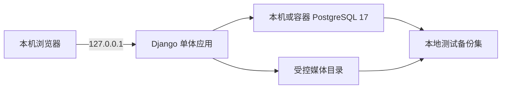
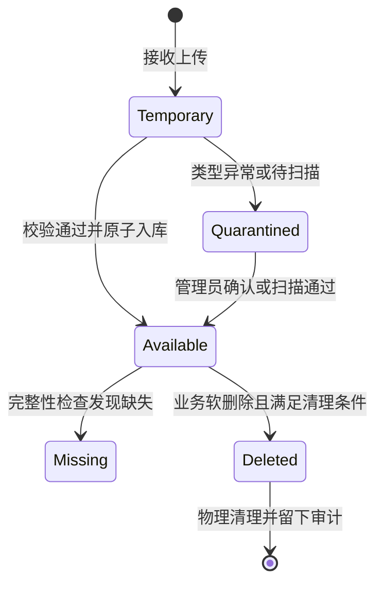

# LabArchive 架构设计

## 1. 状态与目标

本文是 Phase 0 架构基线。当前优先在开发者本机完成开发、自动化测试和个人试运行；核心流程稳定、备份恢复通过后，再进入实验室 Linux 服务器部署。

长期优先级：

```text
数据安全 > 数据完整性 > 权限正确 > 可恢复性 > 长期维护 > 功能 > 界面
```

## 2. 技术版本基线

| 组件 | Phase 0 基线 | 原因 |
| --- | --- | --- |
| Python | 3.13.x | Django 5.2 官方支持；相较最新 Python 主版本保留第三方包兼容余量 |
| Django | 5.2.16 LTS | LTS 安全支持至 2028 年 4 月，适合长期项目起步 |
| PostgreSQL | 17.x，容器基线 17.10 | 官方支持至 2029 年 11 月；成熟且保留较长维护窗口 |
| Psycopg | 3.3.4 | 新项目使用 Psycopg 3 |
| Ruff | 0.15.22 | 统一格式化与静态检查 |

依据：

- [Django 支持版本](https://www.djangoproject.com/download/)
- [Django 5.2 发布说明](https://docs.djangoproject.com/en/5.2/releases/5.2/)
- [PostgreSQL 版本支持政策](https://www.postgresql.org/support/versioning/)

依赖使用精确版本保证可复现；升级时单独提交，阅读发布说明并运行完整测试。Python 固定 3.13 系列，允许升级安全微版本。

## 3. 本地优先架构



本地阶段不引入 Nginx、Redis、任务队列或搜索集群。开发服务器只用于本机调试。服务器部署时增加 Nginx、TLS、服务守护、监控和异地备份，但业务代码与数据模型保持一致。

## 4. 模块边界

| App | 职责 | 不负责 |
| --- | --- | --- |
| `accounts` | 自定义用户、Profile、账号生命周期 | 项目级权限 |
| `projects` | 项目、类型、成员、项目级权限 | 文件二进制存储 |
| `documents` | FileAsset、文档、分类、版本、受控下载 | 报销流程 |
| `expenses` | 报销、分类、附件、状态流转 | 系统级角色管理 |
| `todos` | 个人待办及业务对象关联 | 通用工作流引擎 |
| `audit` | 追加式审计事件、查询 | 普通应用日志 |
| `core` | 抽象模型、健康检查、共享小型基础设施 | 业务规则集中地 |

业务规则放在对应 App 的服务层或模型方法中。页面、管理员后台和未来 API 必须复用相同的权限与状态流转函数。

## 5. 配置分层

```text
config/settings/base.py
├── development.py
├── test.py
└── production.py
```

- `development`：本机使用，允许 Debug，只允许本机 Host；
- `test`：仍使用 PostgreSQL，不回退 SQLite；
- `production`：禁止 Debug，要求真实 Secret，并启用安全 Cookie/TLS 设置；
- 所有路径和凭据由环境变量提供；
- `.env.example` 仅描述变量，不含真实 Secret。

## 6. 身份与权限

第一次 migration 即使用 `accounts.User`，避免后期替换 Django 默认 User。

```text
系统级角色：Django Group + Permission
项目级权限：ProjectMembership
默认规则：没有明确授权即拒绝
```

权限检查分两层：先限制 QuerySet，执行操作前再次检查对象权限。隐藏链接不构成权限控制。下载、导出、管理员后台和未来 API 必须走同一规则。

V1 如需成员级例外权限，字段必须区分“继承、允许、拒绝”；否则仅实现项目角色，避免含义不清的 Boolean。

## 7. 文件架构

`FileAsset` 表示一次不可变的原始上传。`Document` 和 `ExpenseAttachment` 引用它，不重复实现存储与校验。



关键约束：

- 物理文件名使用 UUID 与受控扩展名；
- 数据库只保存相对于 `MEDIA_ROOT` 的路径；
- 入库后不覆盖文件；替换即创建新资产或新版本；
- SHA256 相同只提示，不在 V1 自动去重；
- 上传目录不作为公开静态目录；
- 生产下载由 Django 鉴权，再交给 Nginx 受控传输；
- 数据库提交与文件移动失败时必须补偿，不能留下无主“正常”记录。

## 8. 报销状态机

基础路径：

```text
DRAFT -> SUBMITTED -> PROCESSING -> REIMBURSED -> ARCHIVED
             |             |
             +-- RETURNED -+

DRAFT / RETURNED -> CANCELLED
```

所有状态变化通过服务函数执行，并在同一数据库事务中创建 `ExpenseStatusHistory` 和 `AuditLog`。提交后锁定核心字段；退回后用户才能修改并重新提交。

## 9. 审计

审计从业务功能首次实现时接入。高风险操作在审计写入失败时整体回滚。

审计记录：操作者、动作、对象、旧值、新值、IP、User-Agent、request/task ID、结果与时间。密码、Cookie、Session、认证头和 Secret 永不进入审计字段。业务管理员只能读取，不能修改或删除审计记录。

## 10. 备份与恢复

备份单元是“数据库 + 媒体文件 + 清单”的一致备份集，不是两个互不关联的副本。

本地开发阶段先验证：

1. PostgreSQL dump 可恢复到全新数据库；
2. 媒体清单和 SHA256 可验证；
3. 恢复后数据库引用没有缺失文件；
4. 项目导出可脱离软件阅读。

进入服务器部署前必须确定正式 RPO、RTO、备份目标、异地副本和密钥托管方式。

## 11. 当前默认值与待确认项

| 项目 | 当前开发默认值 | 状态/风险 |
| --- | --- | --- |
| Conda 环境 | `labarchive` | 已确认 |
| Python | 3.13.x | 已确认，跟随安全微版本 |
| 数据库 | PostgreSQL 17 | 已确认技术基线；本机尚未安装 |
| 单文件上限 | 100 MiB | 待真实文件样本验证 |
| 账号创建 | 管理员创建，不开放注册 | 待业务确认 |
| 项目文件可见性 | 项目成员按角色可见 | 待细化角色矩阵 |
| 回收站保留 | 暂定 90 天，V1 默认不自动物理删除 | 待业务确认 |
| RPO | 本地试运行暂定 24 小时 | 正式部署前确认 |
| RTO | 本地试运行暂定 1 个工作日 | 正式部署前确认 |
| 恶意文件扫描 | 接口预留，生产启用方案待定 | 上线前阻塞项 |
| 生产服务器 | 未选择 | 服务器阶段确认 |

## 12. 服务器部署准入

只有满足 `Line.md` 的本地试运行准入条件后才进入 Phase 10。服务器部署不是当前 Phase 0 的完成条件；但 Docker/PostgreSQL 配置必须保持可验证、可迁移，不能形成仅适用于开发者电脑的隐式依赖。
