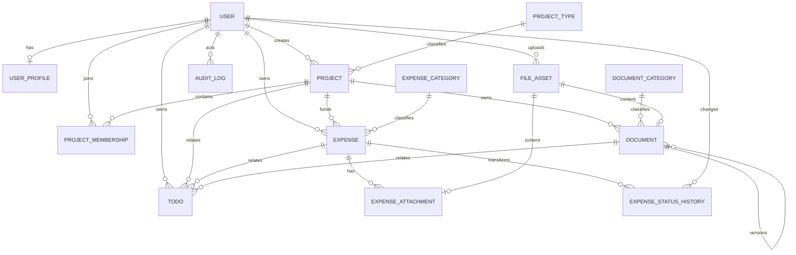

# LabArchive 数据库设计

## 1. 设计状态

本文定义 V1 总体数据模型。Phase 0 代码只落地自定义用户和工程骨架；其他业务模型在对应 Phase 实现前必须再次核对本文、生成 migration 并补齐约束测试。

数据库目标为 PostgreSQL 17。开发和测试不使用 SQLite，避免条件唯一约束、全文搜索、并发锁和字段行为差异被掩盖。

## 2. 通用约定

- 核心对象使用 UUID 主键；不以姓名、项目名或文件名关联；
- 时间字段保存带时区时间，应用时区为 `Asia/Shanghai`；
- 金额使用 `DecimalField`，默认人民币精确到分；
- 外键默认 `PROTECT`，需要删除时由显式业务服务处理；
- 核心业务对象使用 `deleted_at` 软删除；
- 审计日志不允许业务删除；
- 数据库约束与服务端验证并存，不能只依赖表单；
- 真实文件不进入数据库，只保存受控相对路径和完整性元数据。

## 3. 初版 ER 图

说明：Todo 的业务关联在实现前需要在显式可空外键与受约束的通用关联之间二选一，不能直接采用无法保证引用完整性的任意 `related_type + related_id` 字符串。

## 4. 账户

### 4.1 `accounts_user`

基于 Django `AbstractUser`：

| 字段 | 类型 | 规则 |
| --- | --- | --- |
| `id` | UUID | 主键，不可变 |
| `username` | varchar | 唯一，登录标识 |
| `display_name` | varchar | 可空显示名，不作为关联键 |
| `email` | varchar | 可空；V1 不强制唯一 |
| `is_active` | bool | 禁用/离组后为 false |
| `is_staff` | bool | 仅表示后台访问资格，不等于全部业务权限 |
| `date_joined` | timestamptz | Django 字段 |
| `created_at` | timestamptz | 创建时间 |
| `updated_at` | timestamptz | 修改时间 |

系统级角色使用 Django `Group` 和 `Permission`，不复制一套同名权限表。

### 4.2 `accounts_userprofile`

| 字段 | 类型 | 规则 |
| --- | --- | --- |
| `user_id` | UUID FK | 一对一，`CASCADE` 仅因 User 不允许业务删除 |
| `department` | varchar | 可空 |
| `student_or_staff_id` | varchar | 可空；唯一性待确认 |
| `phone` | varchar | 可空、敏感信息 |
| `notes` | text | 可空、限制访问 |
| `archived_at` | timestamptz | 可空 |

## 5. 项目

### 5.1 `projects_projecttype`

可配置项目类型：`id`、`code`、`name`、`is_active`、`sort_order`、时间字段。`code` 永久唯一；名称只在未删除/有效范围内按最终业务规则唯一。

### 5.2 `projects_project`

| 字段 | 类型 | 规则 |
| --- | --- | --- |
| `id` | UUID | 主键 |
| `project_code` | varchar | V1 全局唯一，若现实存在跨年度重复需先改设计 |
| `name` / `short_name` | varchar | `short_name` 可空 |
| `project_type_id` | FK | `PROTECT` |
| `status` | varchar | 受枚举/检查约束 |
| `principal_investigator_id` | User FK | `PROTECT` |
| `start_date` / `end_date` | date | 可空；结束日期不得早于开始日期 |
| `description` | text | 可空 |
| `created_by_id` | User FK | `PROTECT` |
| `created_at` / `updated_at` | timestamptz | 必填 |
| `deleted_at` | timestamptz | 可空、软删除 |

### 5.3 `projects_projectmembership`

| 字段 | 类型 | 规则 |
| --- | --- | --- |
| `id` | UUID | 主键 |
| `project_id` | FK | `PROTECT` |
| `user_id` | FK | `PROTECT` |
| `role` | varchar | PI、MANAGER、MEMBER、VIEWER |
| `joined_at` / `left_at` | timestamptz | 成员生命周期 |

约束：同一项目同一用户只能有一条活动成员记录。V1 默认由角色决定权限；如增加成员例外字段，必须使用可空 Boolean 表达“继承/允许/拒绝”。

## 6. 文件资产和项目文档

### 6.1 `documents_fileasset`

| 字段 | 类型 | 规则 |
| --- | --- | --- |
| `id` | UUID | 主键 |
| `original_filename` | varchar | 仅显示，禁止拼接路径 |
| `stored_filename` | varchar | UUID + 受控扩展名，全局唯一 |
| `relative_path` | varchar | 相对 `MEDIA_ROOT`，唯一 |
| `declared_mime_type` | varchar | 客户端声明，可空 |
| `detected_mime_type` | varchar | 服务端检测结果，可空 |
| `file_size` | bigint | 大于 0，受上传上限限制 |
| `sha256` | char(64) | 小写十六进制，建立索引但 V1 不唯一 |
| `storage_status` | varchar | TEMPORARY、QUARANTINED、AVAILABLE、MISSING、DELETED |
| `uploaded_by_id` | User FK | `PROTECT` |
| `created_at` | timestamptz | 必填 |
| `quarantined_at` / `deleted_at` | timestamptz | 可空 |

`stored_filename`、`relative_path`、`file_size`、`sha256` 在 AVAILABLE 后不可由普通更新流程修改。

### 6.2 `documents_documentcategory`

`id`、`project_id`（系统公共类别时可空的方案需在 Phase 3 决定）、`code`、`name`、`is_active`、`sort_order`、时间字段。分类复用范围必须明确，避免公共类别与项目自定义类别重名混乱。

### 6.3 `documents_document`

| 字段 | 类型 | 规则 |
| --- | --- | --- |
| `id` | UUID | 主键，同时表示一个具体版本 |
| `project_id` | FK | `PROTECT` |
| `category_id` | FK | `PROTECT` |
| `file_asset_id` | FK | `PROTECT`；V1 一对一归属 |
| `document_group_id` | UUID | 同一逻辑文档的稳定分组标识 |
| `version` | positive int | 组内唯一，服务端生成 |
| `is_current` | bool | 组内正常记录仅一个为 true |
| `is_final` | bool | 业务标记，不允许覆盖资产 |
| `title` | varchar | 必填 |
| `description` | text | 可空 |
| `document_date` | date | 可空 |
| `uploaded_by_id` | User FK | `PROTECT` |
| 时间与软删除字段 | timestamptz | 标准字段 |

PostgreSQL 条件唯一约束：同一 `document_group_id` 在 `deleted_at IS NULL AND is_current` 时最多一条记录。

## 7. 报销

### 7.1 `expenses_expensecategory`

`id`、`code`、`name`、`is_active`、`sort_order`、时间字段。`code` 永久唯一；禁用类别不影响历史报销。

### 7.2 `expenses_expense`

| 字段 | 类型 | 规则 |
| --- | --- | --- |
| `id` | UUID | 主键 |
| `title` | varchar | 必填 |
| `user_id` | User FK | `PROTECT`，报销归属人 |
| `project_id` | Project FK | `PROTECT` |
| `category_id` | ExpenseCategory FK | `PROTECT` |
| `amount` | numeric(14,2) | `>= 0`；是否允许 0 在 Phase 4 决定 |
| `expense_date` | date | 必填 |
| `status` | varchar | DRAFT、SUBMITTED、PROCESSING、REIMBURSED、ARCHIVED、RETURNED、CANCELLED |
| `description` / `admin_note` | text | 可空；权限不同 |
| `submitted_at` / `completed_at` | timestamptz | 按状态维护 |
| 时间与软删除字段 | timestamptz | 标准字段 |

状态变更使用事务和行锁避免管理员并发覆盖。页面不得直接写入任意状态值。

### 7.3 `expenses_expenseattachment`

`id`、`expense_id`、`file_asset_id`、`attachment_type`、`uploaded_by_id`、时间与软删除字段。`file_asset_id` 在 V1 唯一，防止一个资产被多个生命周期不一致的附件共享。

### 7.4 `expenses_expensestatushistory`

`id`、`expense_id`、`from_status`、`to_status`、`changed_by_id`、`reason`、`created_at`。历史只追加不修改；退回时 `reason` 必填。

## 8. 待办

`todos_todo` 包含 `id`、`user_id`、标题、描述、状态、到期日、完成时间、时间字段。

业务关联优先考虑三个可空外键 `project_id`、`expense_id`、`document_id`，并用检查约束保证最多一个关联。若未来关联类型显著增加，再评估 Django ContentTypes；V1 不接受无外键保护的自由文本 ID。

## 9. 审计

`audit_auditlog`：

| 字段 | 类型 | 规则 |
| --- | --- | --- |
| `id` | UUID | 主键 |
| `actor_id` | User FK | 可空，`SET_NULL`；同时保存必要 actor snapshot |
| `action` | varchar | 受枚举约束 |
| `object_type` / `object_id` | varchar + UUID | 逻辑目标，不使用级联删除 |
| `description` | text | 简明说明 |
| `old_value` / `new_value` | jsonb | 已脱敏的必要字段 |
| `ip_address` | inet | 可空 |
| `user_agent` | text | 可空、限制长度 |
| `request_id` | UUID | 可空、索引 |
| `result` | varchar | SUCCESS、DENIED、FAILED |
| `created_at` | timestamptz | 只追加、索引 |

审计表不包含 `updated_at`、`deleted_at`。应用不提供更新和删除服务。

## 10. 系统配置

`core_systemsetting` 仅保存允许由管理员调整的非 Secret 配置：键、JSON 值、说明、是否启用、修改人和时间。Secret Key、数据库密码、备份加密密钥永远不进入此表。

## 11. 约束与索引检查清单

每个业务 Phase 必须显式核对：

- 条件唯一约束是否正确处理软删除；
- 常用筛选组合是否有索引；
- `PROTECT` 是否阻止历史归属被删除；
- 金额、日期范围和状态是否有数据库约束；
- 文件资产路径和存储名是否唯一；
- JSON 审计字段是否已脱敏；
- migration 是否能从空 PostgreSQL 数据库顺序执行；
- migration 回滚是否安全，不能以删除生产数据作为普通回滚方案。

## 12. Migration 规则

1. 所有结构变化由 Django migration 管理；
2. migration 与模型、测试在同一提交；
3. 数据 migration 必须可重复评估并记录运行成本；
4. 大表变更在服务器阶段先于生产副本演练；
5. 禁止通过删除数据库或重建全部数据修复普通问题；
6. 首次 migration 必须包含自定义 `accounts.User`，之后不得切换用户模型。
