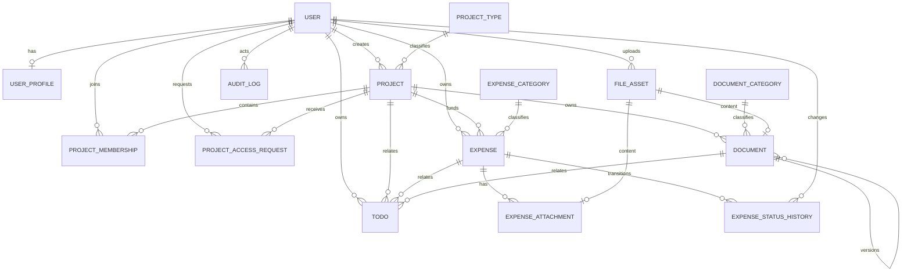

# LabArchive 数据库设计

## 1. 设计状态

本文定义 V1 总体数据模型。Phase 0 落地自定义用户和工程骨架；Phase 1–3 已分别落地账号、项目与项目文件模型。其他业务模型仍须在对应 Phase 实现前再次核对本文、生成 migration 并补齐约束测试。

数据库目标为 PostgreSQL 17。开发和测试不使用 SQLite，避免条件唯一约束、全文搜索、并发锁和字段行为差异被掩盖。

## 2. 通用约定

- 核心对象使用 UUID 主键；不以姓名、项目名或文件名关联；
- 时间字段保存带时区时间，应用时区为 `Asia/Shanghai`；
- 金额使用 `DecimalField`，默认人民币精确到分；
- 外键默认 `PROTECT`，需要删除时由显式业务服务处理；
- 核心业务对象使用 `deleted_at` 软删除；
- 审计日志不允许业务删除；
- 数据库约束与服务端验证并存，不能只依赖表单；
- 真实文件不进入数据库，只保存受控相对路径和完整性元数据。

## 3. 初版 ER 图



说明：Todo 的业务关联在实现前需要在显式可空外键与受约束的通用关联之间二选一，不能直接采用无法保证引用完整性的任意 `related_type + related_id` 字符串。

## 4. 账户

### 4.1 `accounts_user`

基于 Django `AbstractUser`：

| 字段 | 类型 | 规则 |
| --- | --- | --- |
| `id` | UUID | 主键，不可变 |
| `username` | varchar | 唯一，登录标识 |
| `display_name` | varchar | 可空显示名，不作为关联键 |
| `email` | varchar | 可空；V1 不强制唯一 |
| `account_status` | varchar | ACTIVE、DISABLED、DEPARTED、ARCHIVED |
| `must_change_password` | bool | 临时密码首次登录门禁 |
| `is_active` | bool | 仅 ACTIVE 时为 true |
| `is_staff` | bool | 仅表示后台访问资格，不等于全部业务权限 |
| `date_joined` | timestamptz | Django 字段 |
| `created_at` | timestamptz | 创建时间 |
| `updated_at` | timestamptz | 修改时间 |

系统级角色使用 Django `Group` 和 `Permission`，不复制一套同名权限表。

检查约束保证：

```text
(account_status = ACTIVE AND is_active = true)
OR
(account_status != ACTIVE AND is_active = false)
```

账号状态、临时密码重置和角色分配只能通过统一账号服务更新。V1 预定义 `LAB_MEMBER`、`REIMBURSEMENT_ADMIN`、`SYSTEM_ADMIN` 三个 Group；角色定义通过受版本控制的 `post_migrate` 初始化器管理，不开放任意 Permission 编辑。

`DISABLED` 只暂停认证和权限行使，不关闭项目关系；恢复 ACTIVE 时先归一化已自然到期的申请授权。
`DEPARTED` / `ARCHIVED` 是不可逆终态，统一账号服务会在账号状态及审计的同一事务中结束所有活动
Membership，并取消 PENDING / APPROVED 访问申请。未软删除项目的规范 PI 必须先转移。终止账号不
覆盖原审批人的 `reviewed_by` / `reviewed_at` / `review_note`；关闭操作者与原因保存在追加式审计中。

### 4.2 `accounts_userprofile`

| 字段 | 类型 | 规则 |
| --- | --- | --- |
| `user_id` | UUID FK | 一对一，`CASCADE` 仅因 User 不允许业务删除 |
| `department` | varchar | 可空 |
| `student_or_staff_id` | varchar | 可空；唯一性待确认 |
| `phone` | varchar | 可空、敏感信息 |
| `notes` | text | 可空、限制访问 |
| `archived_at` | timestamptz | 可空 |

## 5. 项目

### 5.1 `projects_projecttype`

可配置项目类型：`id`、`code`、`name`、`is_active`、`sort_order`、时间字段。`code` 永久唯一；名称只在未删除/有效范围内按最终业务规则唯一。

### 5.2 `projects_project`

| 字段 | 类型 | 规则 |
| --- | --- | --- |
| `id` | UUID | 主键 |
| `project_code` | varchar | V1 全局唯一，若现实存在跨年度重复需先改设计 |
| `name` / `short_name` | varchar | `short_name` 可空 |
| `project_type_id` | FK | `PROTECT` |
| `status` | varchar | 受枚举/检查约束 |
| `visibility` | varchar | INTERNAL、RESTRICTED；默认 INTERNAL |
| `principal_investigator_id` | User FK | `PROTECT` |
| `start_date` / `end_date` | date | 可空；结束日期不得早于开始日期 |
| `description` | text | 可空 |
| `created_by_id` | User FK | `PROTECT` |
| `created_at` / `updated_at` | timestamptz | 必填 |
| `deleted_at` | timestamptz | 可空、软删除 |

### 5.3 `projects_projectmembership`

| 字段 | 类型 | 规则 |
| --- | --- | --- |
| `id` | UUID | 主键 |
| `project_id` | FK | `PROTECT` |
| `user_id` | FK | `PROTECT` |
| `role` | varchar | PI、MANAGER、MEMBER、VIEWER |
| `joined_at` / `left_at` | timestamptz | 成员生命周期 |
| `access_source` | varchar | DIRECT、APPROVED_REQUEST |
| `source_access_request_id` | AccessRequest 一对一 FK | 申请授权必填，直接授权为空，`PROTECT` |
| `expires_at` | timestamptz | 访问申请产生的临时成员可空到期时间 |

约束：同一项目同一用户只能有一条活动成员记录。`DIRECT` 不关联申请且永不过期；
`APPROVED_REQUEST` 必须一对一关联具体申请且只能授予 `VIEWER`。申请授权被直接晋升时结束旧行并
新建 `DIRECT` 行，不改写历史来源。到期或离组成员不再提供访问权限。V1 不增加成员例外 Boolean；
如未来增加，必须明确表达“继承/允许/拒绝”。

`Project.principal_investigator_id` 是负责人规范事实，PI Membership 是物化授权。数据库保证活动
PI 至多一条以及 PI 的 DIRECT/永久授权形状；负责人 FK 与 PI Membership 用户相等属于跨表不变量，
由项目创建、负责人转移事务和回归测试保证，冲突时权限安全失败。

### 5.4 `projects_projectaccessrequest`

| 字段 | 类型 | 规则 |
| --- | --- | --- |
| `id` | UUID | 主键 |
| `project_id` | Project FK | `PROTECT`，仅 RESTRICTED 项目需要申请 |
| `requester_id` | User FK | `PROTECT`，提交时必须 ACTIVE |
| `reason` | text | 必填，说明整理或汇总用途 |
| `status` | varchar | PENDING、APPROVED、REJECTED、CANCELLED、EXPIRED |
| `reviewed_by_id` | User FK | 可空、`PROTECT` |
| `review_note` | text | 可空；拒绝时必填 |
| `requested_at` / `reviewed_at` | timestamptz | 状态时间 |
| `expires_at` | timestamptz | 可空；批准后可限制期限 |

PostgreSQL 条件唯一约束：同一用户对同一项目在 `status=PENDING` 时最多一条申请。批准必须在同一
事务中创建一条精确绑定该申请的 `VIEWER` ProjectMembership 并写入审计；已有直接成员时，待处理
申请应被直接授权流程取消，陈旧审批不得创建无来源授权。撤销和到期只结束该申请绑定的 Membership；
直接晋升保留旧授权行并创建新的 DIRECT 行。用户永久离组时 PENDING / APPROVED 申请与所有活动
Membership 在账号状态事务中关闭，原审批字段保持不变；DISABLED 则保留仍有效的授权。

超过 `expires_at` 的 Membership 在权限查询中立即失效。项目管理页面和幂等管理命令
`expire_project_access` 将对应申请持久化为 EXPIRED 并写审计；无人访问时的持续自动归一化仍依赖
部署阶段配置并验证外部调度器。

## 6. 文件资产和项目文档

### 6.1 `documents_fileasset`

| 字段 | 类型 | 规则 |
| --- | --- | --- |
| `id` | UUID | 主键 |
| `original_filename` | varchar | 仅显示，禁止拼接路径 |
| `stored_filename` | varchar | UUID + 受控扩展名，全局唯一 |
| `relative_path` | varchar | 相对 `MEDIA_ROOT`，唯一 |
| `declared_mime_type` | varchar | 客户端声明，可空 |
| `detected_mime_type` | varchar | 服务端检测结果，可空 |
| `file_size` | bigint | TEMPORARY/QUARANTINED 可空；可用资产必须大于 0 且受上传上限限制 |
| `sha256` | char(64) | TEMPORARY/QUARANTINED 可空白；可用资产必须为小写十六进制，建立索引但 V1 不唯一 |
| `storage_status` | varchar | TEMPORARY、QUARANTINED、AVAILABLE、MISSING、DELETED |
| `malware_scan_status` | varchar | NOT_CONFIGURED、PENDING、CLEAN、INFECTED、ERROR；不得伪造 CLEAN |
| `status_reason` | varchar | 隔离、缺失或失败的非敏感原因代码，可空 |
| `upload_token` | UUID | 一次性 POST 幂等 token，全局唯一 |
| `uploaded_by_id` | User FK | `PROTECT` |
| `created_at` | timestamptz | 必填 |
| `quarantined_at` / `deleted_at` | timestamptz | 可空 |

`stored_filename`、`relative_path`、`file_size`、`sha256` 在 AVAILABLE 后不可由普通更新流程修改。
状态相关检查约束要求 AVAILABLE/MISSING/DELETED 具有完整的正数大小和 SHA256；TEMPORARY 允许校验元数据
尚未形成，QUARANTINED 允许保留部分证据。`stored_filename` 和 `relative_path` 全局唯一，所有 key 由
服务器生成且为相对路径。状态转换、扫描语义和 saga 见 ADR-0006。

### 6.2 `documents_documentcategory`

`id`、`project_id`、`code`、`name`、`is_active`、`sort_order`、时间字段。`project_id IS NULL` 表示系统
内置/全局分类，非空表示该项目自定义分类。全局范围和每个项目范围分别对大小写不敏感的 `code`、`name`
建立唯一约束；停用保留历史引用，但不能用于新文档。分类所属项目在创建后不可通过受支持服务改写。

### 6.3 `documents_document`

| 字段 | 类型 | 规则 |
| --- | --- | --- |
| `id` | UUID | 主键，同时表示一个具体版本 |
| `project_id` | FK | `PROTECT` |
| `category_id` | FK | `PROTECT` |
| `file_asset_id` | FK | `PROTECT`；V1 一对一归属 |
| `document_group_id` | UUID | 同一逻辑文档的稳定分组标识 |
| `version` | positive int | 组内唯一，服务端生成 |
| `is_current` | bool | 组内正常记录仅一个为 true |
| `is_final` | bool | 业务标记，不允许覆盖资产 |
| `title` | varchar | 必填 |
| `description` | text | 可空 |
| `document_date` | date | 可空 |
| `uploaded_by_id` | User FK | `PROTECT` |
| 时间与软删除字段 | timestamptz | 标准字段 |

PostgreSQL 条件唯一约束：同一 `document_group_id` 在 `deleted_at IS NULL AND is_current` 时最多一条记录。
同一 group 的 `version` 唯一且必须大于 0；`file_asset_id` 一对一。Phase 3 新上传均创建独立 group、
`version=1`、`is_current=true`。PostgreSQL 约束触发器与服务层共同保证：分类必须启用，且只能是全局分类
或与 Document 相同项目的自定义分类。Document 软删除与 FileAsset DELETED 状态同步，物理文件仍保留；
恢复通过完整性和安全检查后才清除删除状态。

### 6.4 Phase 3 migration 与运行状态

Phase 3 结构由 `documents.0001_initial` 建立，并由 `audit.0003` / `audit.0004` 扩展文件生命周期和
reconciliation 审计动作。CP7 页面与表单没有改变模型，因此没有新增 migration。当前本机开发库已应用：

```text
audit.0001–0004       [X]
documents.0001        [X]
```

应用 `audit.0004` 前创建 `.local/backups/pre-phase3-cp6-20260820.dump`，SHA-256 为
`19b50cc27a9fde3857d84e7b8f7751af4fef559e4d40a1b7d7284e8a08ee9cdf`，并通过
`pg_restore --list` 验证目录可读。该证据是本机迁移前快照，不等同于服务器恢复演练。

全局唯一 `upload_token` 的最终并发仲裁由 PostgreSQL 唯一约束承担；服务捕获冲突后锁定并复核 token
归属，从而把同一 token 的并发 POST 收敛到同一 Document，而不是依赖有竞态的表单预查询。

## 7. 报销

### 7.1 `expenses_expensecategory`

`id`、`code`、`name`、`is_active`、`sort_order`、时间字段。`code` 永久唯一；禁用类别不影响历史报销。

### 7.2 `expenses_expense`

| 字段 | 类型 | 规则 |
| --- | --- | --- |
| `id` | UUID | 主键 |
| `title` | varchar | 必填 |
| `user_id` | User FK | `PROTECT`，报销归属人 |
| `project_id` | Project FK | `PROTECT` |
| `category_id` | ExpenseCategory FK | `PROTECT` |
| `amount` | numeric(14,2) | `>= 0`；是否允许 0 在 Phase 4 决定 |
| `expense_date` | date | 必填 |
| `status` | varchar | DRAFT、SUBMITTED、PROCESSING、REIMBURSED、ARCHIVED、RETURNED、CANCELLED |
| `description` / `admin_note` | text | 可空；权限不同 |
| `submitted_at` / `completed_at` | timestamptz | 按状态维护 |
| 时间与软删除字段 | timestamptz | 标准字段 |

状态变更使用事务和行锁避免管理员并发覆盖。页面不得直接写入任意状态值。

### 7.3 `expenses_expenseattachment`

`id`、`expense_id`、`file_asset_id`、`attachment_type`、`uploaded_by_id`、时间与软删除字段。`file_asset_id` 在 V1 唯一，防止一个资产被多个生命周期不一致的附件共享。

### 7.4 `expenses_expensestatushistory`

`id`、`expense_id`、`from_status`、`to_status`、`changed_by_id`、`reason`、`created_at`。历史只追加不修改；退回时 `reason` 必填。

## 8. 待办

`todos_todo` 包含 `id`、`user_id`、标题、描述、状态、到期日、完成时间、时间字段。

业务关联优先考虑三个可空外键 `project_id`、`expense_id`、`document_id`，并用检查约束保证最多一个关联。若未来关联类型显著增加，再评估 Django ContentTypes；V1 不接受无外键保护的自由文本 ID。

## 9. 审计

`audit_auditlog`：

| 字段 | 类型 | 规则 |
| --- | --- | --- |
| `id` | UUID | 主键 |
| `actor_id` | User FK | 可空，`SET_NULL`；同时保存必要 actor snapshot |
| `action` | varchar | 受枚举约束 |
| `object_type` / `object_id` | varchar + UUID | 逻辑目标，不使用级联删除 |
| `description` | text | 简明说明 |
| `old_value` / `new_value` | jsonb | 已脱敏的必要字段 |
| `ip_address` | inet | 可空 |
| `user_agent` | text | 可空、限制长度 |
| `request_id` | UUID | 可空、索引 |
| `result` | varchar | SUCCESS、DENIED、FAILED |
| `created_at` | timestamptz | 只追加、索引 |

审计表不包含 `updated_at`、`deleted_at`。应用不提供更新和删除服务。

## 10. 系统配置

`core_systemsetting` 仅保存允许由管理员调整的非 Secret 配置：键、JSON 值、说明、是否启用、修改人和时间。Secret Key、数据库密码、备份加密密钥永远不进入此表。

## 11. 约束与索引检查清单

每个业务 Phase 必须显式核对：

- 条件唯一约束是否正确处理软删除；
- 常用筛选组合是否有索引；
- `PROTECT` 是否阻止历史归属被删除；
- 金额、日期范围和状态是否有数据库约束；
- 文件资产路径和存储名是否唯一；
- JSON 审计字段是否已脱敏；
- migration 是否能从空 PostgreSQL 数据库顺序执行；
- migration 回滚是否安全，不能以删除生产数据作为普通回滚方案。

## 12. Migration 规则

1. 所有结构变化由 Django migration 管理；
2. migration 与模型、测试在同一提交；
3. 数据 migration 必须可重复评估并记录运行成本；
4. 大表变更在服务器阶段先于生产副本演练；
5. 禁止通过删除数据库或重建全部数据修复普通问题；
6. 首次 migration 必须包含自定义 `accounts.User`，之后不得切换用户模型。
