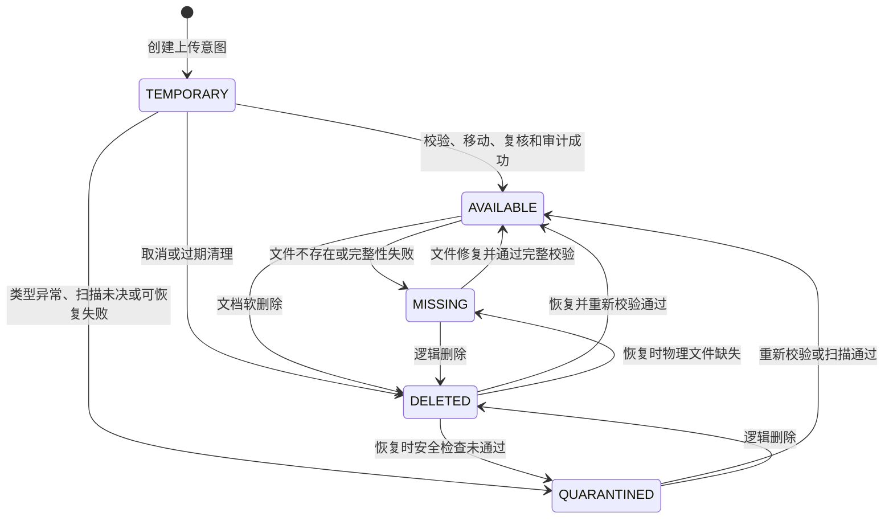

# ADR-0006：Phase 3 文件存储、安全状态与可恢复事务

- 状态：接受
- 日期：2026-08-19
- 实施状态：Phase 3 CP0–CP7 已于 2026-08-20 完成本地实现和独立验收；生产扫描与部署验证仍保留到上线阶段

## 背景

Phase 3 首次引入真实文件。PostgreSQL 事务不能覆盖文件系统移动，原始文件名和客户端 MIME 不可信，
项目授权还会随账号、项目状态、成员关系和访问申请变化。若直接把上传写入最终目录或把媒体目录公开，
会产生路径穿越、IDOR、未知 orphan、数据库与物理文件不一致以及失权后继续下载等风险。

本 ADR 冻结 Phase 3 可实施范围。报销附件只在 Phase 4 复用 `FileAsset` 基础设施，本阶段不引入报销
模型。完整替换、历史版本切换和批量版本管理仍属于 V2。

## 决策

### 1. 分类与版本骨架

`DocumentCategory` 支持两种范围：

- `project IS NULL`：系统内置或全局分类，仅 `SYSTEM_ADMIN` 管理；
- `project IS NOT NULL`：项目自定义分类，仅该项目 PI、MANAGER 或 `SYSTEM_ADMIN` 管理。

新建文档只能使用启用的全局分类或本项目启用的自定义分类。数据库约束保证分类范围、名称和代码的
唯一性；PostgreSQL 约束触发器与服务层重复验证分类启用状态和项目归属，阻止项目 A 使用项目 B 的分类。
分类的 `project` 创建后不可通过受支持服务改写。

Phase 3 保留 `document_group_id`、`version` 和 `is_current`。普通新上传创建独立 group，固定为
`version=1`、`is_current=true`。本阶段不提供替换、v2/v3、版本切换或删除后的自动回退。

### 2. 格式白名单与真实类型检测

允许格式固定为 PDF、DOCX、XLSX、PNG、JPEG/JPG 和 ZIP；拒绝旧 `.doc`、`.xls`，以及 HTML、SVG、
脚本和带宏 OOXML。客户端 MIME 只保存为参考。

由于白名单很小且均有稳定的二进制或容器结构，本阶段不增加 libmagic 原生依赖。服务端检测器使用
Python 标准库实现确定性检查：

- PDF、PNG、JPEG 检查二进制签名及必要的结构终止标记；
- DOCX/XLSX 先按 ZIP 安全规则检查，再验证 `[Content_Types].xml`、关系文件以及
  `word/document.xml` 或 `xl/workbook.xml`；
- 普通 ZIP 只验证，不将成员解压为业务文件。

检测器保留可替换接口；以后引入新格式或更强检测器必须补依赖矩阵和回归，不能退化为只信扩展名。

### 3. ZIP 安全默认值

所有阈值进入 settings，不散落在业务代码：

| 项目 | Phase 3 默认值 |
| --- | --- |
| 上传文件上限 | 100 MiB |
| ZIP 解压后总大小上限 | 1 GiB |
| ZIP 单成员解压后上限 | 256 MiB |
| ZIP 最大压缩倍率 | 100:1 |
| ZIP 最大成员数量 | 10,000 |

拒绝加密成员、符号链接和特殊文件、绝对路径、Windows drive 路径、反斜杠路径、空路径段、`.`/`..`
路径段以及嵌套 ZIP。校验只读取目录和必要的受限内容，不向文件系统展开成员。

### 4. 恶意软件扫描语义

确定性检查与恶意软件扫描是两个不同事实：

- 本地和 CI 在大小、路径、扩展名、真实类型、OOXML/ZIP 和 SHA256 全部通过后，可以进入 AVAILABLE；
- 扫描 adapter 明确返回 `NOT_CONFIGURED`、`PENDING`、`CLEAN`、`INFECTED` 或 `ERROR`；
- 没有真实扫描器时绝不记录 `CLEAN` 或“病毒扫描通过”；
- production 必须配置为要求真实扫描；扫描器未配置、不可用、超时或报错时 fail closed，文件保持
  QUARANTINED，不能下载。

生产扫描器选择和运行验证是上线阻塞项，但 adapter、状态字段和 fail-closed 语义从 Phase 3 起固定。

### 5. 服务器路径与可恢复 saga

原始文件名仅为显示元数据，永不参与路径拼接。服务器以 UUID 和受控扩展名生成相对 storage key；
数据库不保存客户端路径或任意绝对路径。staging 与最终目录必须位于同一受控文件系统，以便使用原子
rename/replace。

上传采用可恢复 saga：

1. 按 User → Project 锁序重新鉴权，创建持久化 TEMPORARY `FileAsset`、对应 `Document` 和一次性
   upload token；
2. 文件写入由 asset UUID 派生的受控 staging key，流式计数并计算 SHA256；
3. 完成扩展名、真实类型、OOXML/ZIP 和扫描策略检查；
4. 使用服务器生成的最终 key 原子移动；
5. 第二事务按 User → Project → Document → FileAsset 锁序重新读取并复核账号、项目、文档和资产；
6. 只有最终文件存在且全部门禁通过时才标记 AVAILABLE 并写成功审计。

文件系统和数据库不伪装成共同 ACID 事务。move、DB commit 或 audit 失败必须留下 TEMPORARY、
QUARANTINED、MISSING 等可解释状态，或完成明确补偿；不能产生未知“正常”记录。

维护服务负责：

- 清理超过可配置期限且没有活动处理者的 staging 文件；
- 将有 DB 引用但文件缺失的资产标记 MISSING；
- 报告或隔离最终目录中没有 DB 记录的文件，不自动静默删除；
- 对 move 成功但第二事务失败、audit 失败和进程中断进行幂等 reconciliation；
- 所有修复动作记录 request/task ID、旧状态、新状态和结果。

### 6. 状态机与生命周期



`Document` 与 `FileAsset` 在 V1 为一对一生命周期：Document 是项目业务记录，FileAsset 是不可变
物理资产元数据。普通查询只展示未软删除 Document；只有未软删除且 FileAsset=AVAILABLE 的记录可下载。
软删除在同一数据库事务中设置 Document 删除时间和 FileAsset DELETED/删除时间，但保留物理字节。
恢复同时复核存在性、完整性、安全和权限；普通 Phase 3 页面不提供永久物理删除。

### 7. 幂等、重复与锁序

每个上传表单使用一次性 UUID token，数据库全局唯一。同一 token 的重复或并发 POST 只能得到同一上传
结果。相同名称和相同 SHA256 均不构成资产共享：合法上传仍创建独立 FileAsset、Document 和审计；
界面可以提示重复但不自动去重或拒绝。

文件写事务沿用 Phase 2 的规范顺序并扩展为：

```text
User(s) by PK
→ Project(s) by PK
→ Document / document_group by PK
→ FileAsset(s) by PK
```

项目归档、账号禁用/离组与文件上传、删除、恢复交叉时不得逆序取锁。CP6 使用真实 PostgreSQL 线程事务
覆盖高风险竞态。

### 8. 权限与项目状态

| 操作 | SYSTEM_ADMIN | PI / MANAGER | MEMBER | VIEWER / 普通 INTERNAL 读者 |
| --- | --- | --- | --- | --- |
| 读取/下载可访问项目的正常文件 | 是 | 是 | 是 | 是 |
| 上传 | 是 | 是 | 是 | 否 |
| 管理项目自定义分类 | 是 | 是 | 否 | 否 |
| 修改/软删除文件 | 是 | 全部项目文件 | 仅本人上传 | 否 |
| 从回收站恢复 | 是 | 本项目文件 | 否 | 否 |

`REIMBURSEMENT_ADMIN` 不因系统角色获得 RESTRICTED 项目文件权限。soft-deleted Project 拒绝全部文件
访问；ARCHIVED 允许已有权限者读取/下载但禁止上传、修改、删除、恢复和分类写入；PLANNING、ACTIVE、
PAUSED、COMPLETED 延续 Phase 2 角色规则。账号或成员资格变化后，每次请求都重新鉴权。

### 9. 下载与完整性

媒体目录不映射为公开 URL。下载只能通过受控 Django endpoint/service：重新认证和项目授权，限定未删除
Document 与 AVAILABLE FileAsset，解析受控 storage key，确认文件存在，生成 attachment 类型的安全
Content-Disposition，并在打开文件后写下载审计。审计“成功”表示服务器已鉴权、校验并开始受控传输，
不表示客户端已完整接收网络流。

`Line.md` 没有要求每次下载前全量重算至多 100 MiB 的 SHA256，因此 Phase 3 采用：上传入库时强校验；
下载时检查状态、路径和存在性；恢复、MISSING 修复、reconciliation、显式完整性检查及检测到文件元数据
异常时重新计算 SHA256。任何已知缺失或校验失败都会先转为 MISSING/QUARANTINED，禁止继续下载。

## 未采用方案

- 公开 `MEDIA_URL`：会绕过对象权限和审计；
- 直接使用原始文件名：存在重名、路径和跨平台风险；
- 把客户端 MIME 或扩展名当作真实类型：不满足服务端检测要求；
- 当前引入 libmagic：对固定小白名单增加 macOS、Docker 和 CI 原生依赖面，收益不足；
- 文件与数据库“共同事务”：文件系统不参与 PostgreSQL ACID，只能使用可恢复 saga；
- SHA256 自动去重：引用生命周期未成熟，可能造成跨业务误删；
- 每次下载全量重哈希：当前需求未要求，且会使最大文件每次额外读一遍；已知异常仍严格 fail closed；
- 普通页面永久删除：不符合默认软删除和可恢复性原则。

## 后果

- CP1 必须实现状态、扫描事实、分类范围、版本骨架、幂等 token 和权限所需字段及数据库约束；
- CP2 以后必须实现 staging、检测器、saga、补偿和 reconciliation，不能直接向最终目录保存；
- 测试媒体根目录必须使用每个测试独立临时目录并验证清理，不能污染固定 `.local/test-media`；
- 未来 Phase 4 复用 FileAsset 时必须保持业务对象与资产一对一，不得改变本 ADR 的路径和扫描语义；
- 生产启用前必须选择并验证真实恶意软件扫描器。

## 实施与验证记录

CP1–CP6 已把本 ADR 的模型、约束、受控存储、可恢复上传、鉴权下载、软删除/恢复、reconciliation 和
锁序落为代码。CP7 页面只编排这些既有服务，没有直接写文件状态或公开媒体路径。当前本地 PostgreSQL
回归覆盖同 token 跨项目竞争、上传/恢复与归档/账号禁用、删除与归档锁序及并发 reconciliation；
PDF、DOCX、XLSX、PNG、JPEG、ZIP 的上传、下载和 SHA256 联合样本通过。

本地/CI 没有把 `NOT_CONFIGURED` 伪装成病毒扫描通过。production settings 要求真实 `CLEAN`，而正式
扫描器选择、服务器文件系统权限、Nginx 受控传输和备份恢复演练仍是部署准入项，不属于 Phase 3 本地
完成声明。
